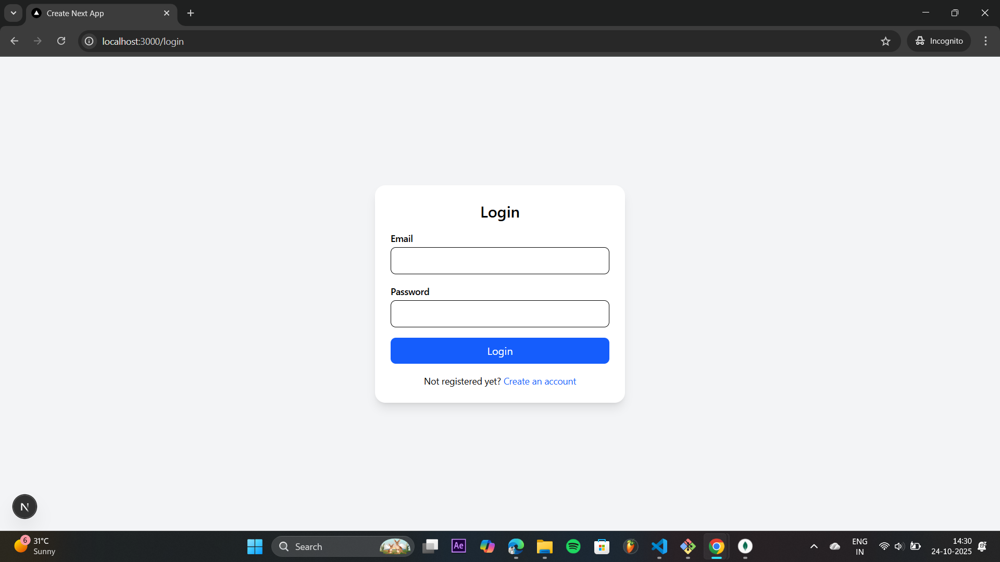
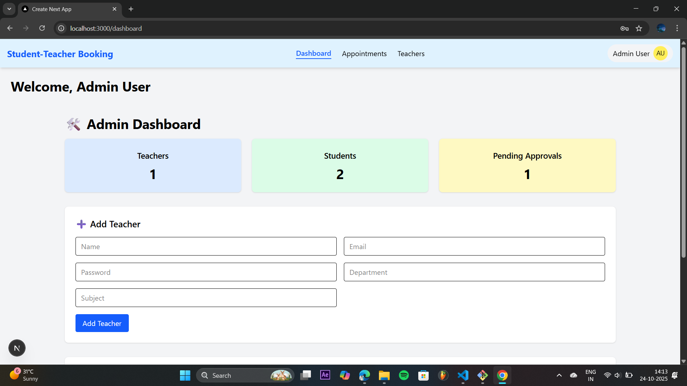
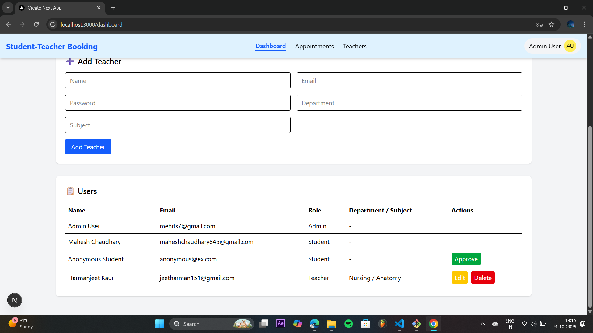
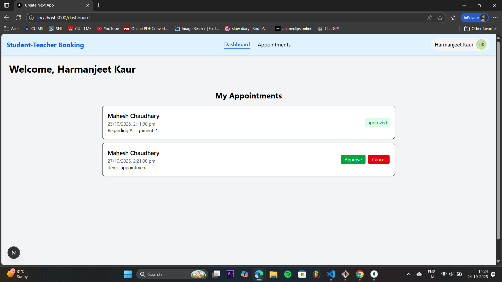
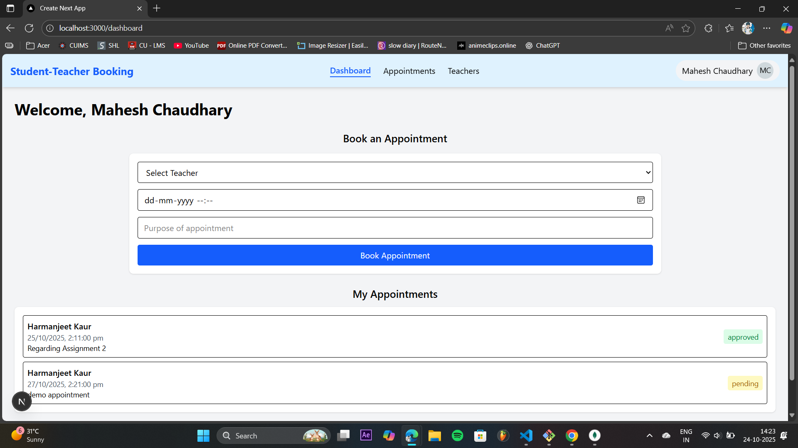

# 🧑‍🎓 Student–Teacher Booking Appointment System

A full-stack web application built with **Next.js**, **MongoDB**, and **JWT Authentication**, allowing students to book appointments with teachers, while admins manage users and approvals.

---

## 🚀 Live Demo
🔗 [View Deployed App on Vercel](https://student-teacher-app-bice.vercel.app/)

---

## ✨ Features

### 👨‍🎓 For Students:
- Register and log in securely.
- View list of approved teachers.
- Book appointments with teachers.
- View booking history.

### 👨‍🏫 For Teachers:
- Register with department and subject details.
- View bookings made by students.
- Manage appointment availability.

### 🛠️ For Admin:
- Approve or reject new student/teacher accounts.
- View all users (students, teachers).
- Delete or manage teacher and student accounts.

### 🔐 Authentication:
- Secure login using **JWT tokens** stored in cookies.
- Passwords hashed using **bcrypt**.
- Middleware protection for private routes.

---

## 💻 Tech Stack

| Category | Technology |
|-----------|-------------|
| Frontend | Next.js 14, React, Tailwind CSS |
| Backend | Next.js API Routes |
| Database | MongoDB with Mongoose |
| Authentication | JSON Web Token (JWT) |
| Deployment | Vercel |
| Other | dotenv, bcrypt, cookie-based sessions |

---

## ⚙️ Setup Instructions

### 1. Clone this Repository:
```bash
git clone https://github.com/yourusername/student-teacher-booking.git
cd student-teacher-booking
```

### 2. Install Dependencies:
```bash
npm install
```

### 3. Create `.env.local` file in root and add:
```env
MONGODB_URI=your_mongodb_connection_string
JWT_SECRET=your_secret_key
NEXT_PUBLIC_API_URL=http://localhost:3000
```

---

## 🧑‍💻 Run Locally
```bash
npm run dev
```
Then visit 👉 [http://localhost:3000](http://localhost:3000)

---

## 🛜 Deployment (on Vercel)

1. Push your code to **GitHub**.
2. Go to [Vercel.com](https://vercel.com/).
3. Click **“New Project” → “Import Git Repository”**.
4. Connect your repo.
5. Add the same environment variables as above in **Vercel → Settings → Environment Variables**.
6. Click **Deploy** 🚀

---

## 🖼️ Screenshots

- **Login Page**


- **Register Page**


- **Admin Dashboard**



- **Teacher Dashboard**


- **Student Booking Page**


---

## 📜 License
This project is licensed under the **MIT License** — free for personal and commercial use.

---

## 👨‍💻 Author
**Developed by:** Mahesh Chaudhary  
**GitHub:** [@maheshchaudhary845](https://github.com/maheshchaudhary845)  
**Deployed on:** [Vercel](https://vercel.com)
